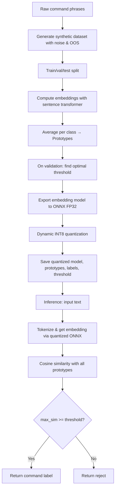

# Approach Document – Speech Command Classifier

## Overview

This project implements a lightweight speech command classifier for edge deployment. The system accepts text generated by an Automatic Speech Recognition (ASR) engine and classifies it into predefined command categories while rejecting out-of-scope (OOS) inputs. The design targets:

* Offline operation
* Model size ≤ 25 MB
* Inference latency < 1 second
* Robustness to ASR noise
* Easy addition of new commands without retraining the embedding model

---

## Algorithms

### 1. Data Generation

For each command, we take manually defined base phrases and apply stochastic noise augmentation to simulate realistic ASR errors.

Augmentations include:

* **Word deletion** (simulate ASR dropping short words) using `nlpaug.RandomWordAug`
* **Typo insertion** through rule-based replacements (e.g., `volume → volum`)
* **Filler word insertion** such as `um`, `uh`, and `like`
* **Indian accent simulation** using substitutions such as `ve → we` and `th → d`

Out-of-scope (OOS) sentences are collected separately and included only in the validation and test sets.

---

### 2. Prototype Training

Given a training set:

```text
{ (text_i, label_i) }
```

a sentence transformer `f` maps each text sample to an embedding vector:

```text
e_i = f(text_i)
```

For each class `c`, a prototype vector is computed as the mean embedding of all samples belonging to that class:

```text
proto_c = mean( { e_i | label_i == c } )
```

For a new input text `x`:

```text
score_c = cosine_similarity( f(x), proto_c )
predicted = argmax_c score_c
```

Decision rule:

```text
if max(score_c) >= threshold:
    return predicted
else:
    return "reject"
```

This approach eliminates the need for a trainable classifier while allowing easy extension to new commands.

---

### 3. Threshold Selection

The validation set contains both in-scope and OOS examples.

For each candidate threshold:

```text
t ∈ [0.4, 0.9]
```

the following are computed:

* Similarity of in-scope samples to their correct prototype
* Maximum similarity of OOS samples to any prototype

The threshold that maximizes F1-score is selected, balancing:

* High OOS rejection rate
* Low false rejection rate

---

### 4. Model Export & Quantisation

The sentence transformer model is exported using the legacy ONNX exporter with:

```text
Opset Version = 18
```

Pipeline:

```text
Sentence Transformer
        ↓
ONNX FP32
        ↓
Dynamic INT8 Quantisation
        ↓
Quantized ONNX Model
```

Dynamic INT8 quantisation (`quantize_dynamic`) reduces model size by approximately 4× while maintaining nearly identical classification performance.

---

## Web Interface

A lightweight web interface is implemented using Streamlit.

The interface:

1. Loads the quantized ONNX model.
2. Loads prototypes, labels, and threshold values.
3. Accepts ASR-generated text input.
4. Runs inference through the classifier.
5. Displays the predicted command and confidence score.
6. Rejects out-of-scope inputs when confidence falls below the threshold.

Workflow:

```text
User Input
      ↓
Streamlit Interface
      ↓
CommandClassifier
      ↓
ONNX MiniLM Embedding
      ↓
Cosine Similarity
      ↓
Prediction / Reject
```

---

## Robustness Analysis

To evaluate resistance to ASR errors, a separate robustness analysis module is implemented.

The evaluation progressively injects word deletion noise into test samples using:

```python
RandomWordAug(action="delete", aug_p=level)
```

Noise levels tested:

```text
0.0, 0.2, 0.4, 0.6, 0.8
```

For each noise level:

1. Generate noisy text.
2. Run classification.
3. Compare prediction with ground truth.
4. Compute classification accuracy.

The resulting graph:

```text
noise_robustness.png
```

illustrates how accuracy changes as noise increases.

This experiment measures the classifier's robustness to realistic ASR transcription errors.

---

## Flowchart



---

## Trade-offs

### Accuracy vs Size

A lightweight MiniLM-L3 sentence transformer is used to achieve high classification performance while maintaining a compact deployment footprint.

Dynamic INT8 quantisation slightly reduces numerical precision but keeps the model size below 25 MB.

### Latency

Embedding generation is the most computationally intensive step. ONNX Runtime execution on CPU remains sufficiently fast, achieving inference times below 100 ms on modern hardware.

### Extensibility

New commands can be added by introducing additional examples and recomputing class prototypes.

Advantages:

* No retraining required
* No ONNX re-export required
* Fast updates

Limitation:

* Prototype-based classification cannot model highly complex intra-class decision boundaries as effectively as a fully fine-tuned classifier.

```
```
